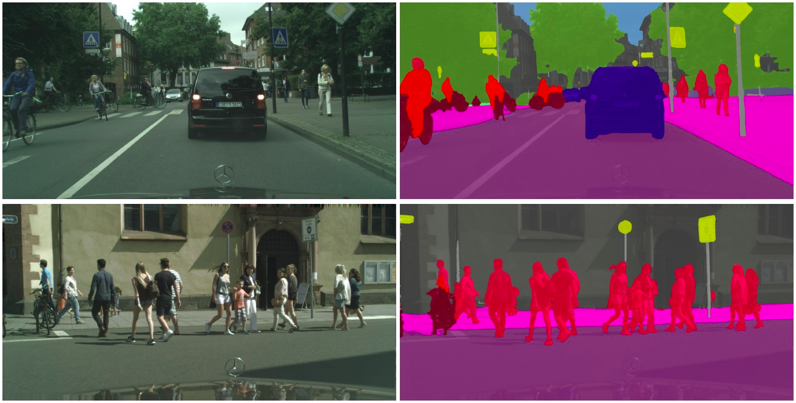

# Self_Driving_Car_Semantic_Segmentation

**Semantic Segmentation for Self-Driving Cars using the Mapillary Dataset**

## Description

This project involves using Deep Neural Networks to identify people and objects on the road, to allow self driving cars to be better 'aware' of their sorroundings.

It uses two neural network architectures to do two different tasks. The main task of Semantic Segmentation is done using the Unet architecture(https://en.wikipedia.org/wiki/U-Net) , and was trained using the Mapillary Dataset.

The second neural network it uses is YOLOv3. This is used for object detection, but was not trained by me. Because it requires extensive computational resources, I just used pretrained weights. More details about the weights and the model can be found on https://pjreddie.com/darknet/yolo/

## Dataset

The Mapillary Dataset contains about 25000 high resolution images of road situations from around the world. It has a labelled train set of 18000 images, a labelled validation set of 2000 images and a test set of 5000 unlabelled images.

More details can be found on the website. (https://www.mapillary.com/dataset/vistas)

A copy of this dataset is required if you want to run these notebooks yourself. They can be downloaded after registering on their website.

## Additional Files

Some files required for this project were too large for GitHub so I've hosted them on cloud storage.
You can find them at https://mega.nz/#F!Vnon0KiY!J21HmhUyQ5gFettlMOh6vw
These files need to be extracted and placed in the project folder to run the models.

## Notebooks

The main notebooks in this project are:

1. Semantic_Segmentation_Mapillary.ipynb - This is the main notebook of this project. It contains the process of training and testing the Unet model.
2. Semantic Segmentation with Object Detection - This is an extension of the project to include object detection as well using the pretrained YOLOv3 model.
3. Image Preprocessor - This notebook is useful to resize the images in the dataset, before training the model. I trained my model on 256x256 images to reduce the computational complexity.

## File and Folder Descriptions

There are some additional useful files as well:

1. semantic_segmentation.py - The implementation of the model along with various helper functions to read and process images, metrics and plotting utilities are all contained within this file. They are imported into the notebook when required.

2. image_preprocessor.py - This file contains a functional implemenation of the Image Preprocessor, but with slightly less flexibility of options.

3. mapillary_model_final_weights.h5 - These were the final model weights when trained with a subset of the data on my local machine. The unet weights folder contains a weights file that was trained on the full dataset until a 91% train accuracy on Google Colab. You could import these weights into the model if you do not want to train the model.

4. The yolo_weights folder contains the pretrained weights for the YOLOv3 model and the checkpoints folder holds the checkpoints that the model creates while training.

5. logs - This contains the Tensorboard logs of the training process, you could use these to view the convergence graphs on Tensorboard.

6. Use the demo_images folder to save downloaded images and test them with Notebook 2 (Semantic Segmentation with Object Detection).

7. There are a few other miscellanous files such as *models.py*, *coco.names* and *utils.py*. These contain the implementation and additional functions for the YOLOv3 model.

## Presentation

The presentation for this project can be found online at https://www.canva.com/design/DAD1fj1sdqM/J4MYX2xHc50keEciZFUqHg/view?utm_content=DAD1fj1sdqM&utm_campaign=designshare&utm_medium=link&utm_source=homepage_design_menu

A copy is also included in the repository as *Semantic Segmentation for Self-Driving Cars.pdf*

## References

The references I used for this project are:

1. https://towardsdatascience.com/cityscape-segmentation-with-tensorflow-2-0-b320b6605cbf
2. https://towardsdatascience.com/a-keras-pipeline-for-image-segmentation-part-1-6515a421157d
3. https://github.com/advaitsave/Multiclass-Semantic-Segmentation-CamVid
4. Hands on Computer Vision with Tensorflow 2 by Benjamin Planche and Eliot Andres (https://www.packtpub.com/application-development/hands-computer-vision-tensorflow-2)
